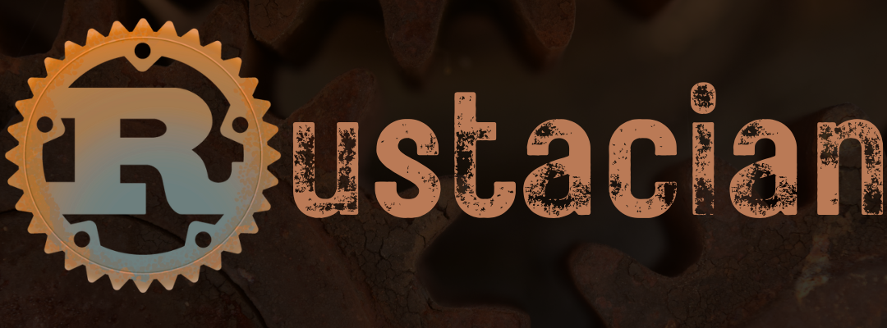

# Rust-101



**Rust-101** is a repository that serves as a starting point for learning Rust programming. This repository contains example code, exercises, and resources to help you get started with **Rust**, a modern systems programming language known for its safety, speed, and concurrency features.

## Table of Contents

- [Rust-101](#rust-101)
  - [Table of Contents](#table-of-contents)
  - [Getting Started](#getting-started)
  - [Code](#code)
  - [Notebooks](#notebooks)
    - [How to Use Rust Notebooks](#how-to-use-rust-notebooks)
  - [Exercises](#exercises)
  - [Contributing](#contributing)
  - [License](#license)

## Getting Started

To get started with **Rust-101**, you'll need to have Rust and Cargo (the Rust package manager) installed on your system. If you haven't already, you can install Rust by following the instructions on the [official Rust website](https://www.rust-lang.org/learn/get-started).

Once you have Rust and Cargo installed, you can clone this repository:

```bash
git clone https://github.com/qcversity/Rust-101.git
cd Rust-101
```

## Code

The **Code** directory contains various Rust code examples that demonstrate different aspects of the Rust programming language. You can explore these examples to understand Rust syntax, data types, and common programming patterns.

## Notebooks

The **Notebooks** directory in this repository contains Jupyter notebooks written in Rust. These notebooks are a great resource for learning and experimenting with Rust in an interactive and documentation-friendly environment. Each notebook provides a hands-on approach to understanding various Rust concepts and can be a valuable resource for both beginners and experienced Rust programmers.

### How to Use Rust Notebooks

1. Ensure you have the `evcxr_jupyter` tool installed for Rust. If not, refer to the [Setting up Rust](./Setup/setup.md) section for instructions.

2. Start a Jupyter Notebook server using `jupyter notebook` or `jupyter lab`.

3. Navigate to the **Notebooks** directory, where you can find a collection of Rust notebooks.

4. Open a notebook by clicking on its filename.

5. You can run the code cells in the notebook to see the results interactively and explore the Rust code examples provided.

These notebooks are designed to be a practical companion to your Rust learning journey. Explore, modify, and experiment with the Rust code within the notebooks to get the best out of these notebooks, and I hope they will helpful in your Rust programming endeabvors.

## Exercises

The **exercises** directory contains a set of coding exercises to help you practice and deepen your understanding of Rust. These exercises cover a range of topics and difficulty levels, making them suitable for beginners and more experienced Rust programmers.

If you're new to Rust, we recommend starting with the exercises in the **beginner** directory. As you become more comfortable with the language, you can tackle the challenges in the **intermediate** and **advanced** directories.

## Contributing

We welcome contributions from the Rust community! If you have code examples, exercises, or documentation improvements to offer, please feel free to open a pull request.

1. Fork this repository.
2. Create a new branch for your changes.
3. Make your changes, add new examples, or improve existing ones.
4. Test your changes if applicable.
5. Commit your changes and create a descriptive pull request.
6. Provide a clear and informative description of your contributions.

We appreciate your help in making **Rust-101** a valuable resource for Rust learners.

## License

<p xmlns:cc="http://creativecommons.org/ns#" xmlns:dct="http://purl.org/dc/terms/"><span property="dct:title">Rust-101</span> by <a rel="cc:attributionURL dct:creator" property="cc:attributionName" href="https://qa.linkedin.com/in/saad-laouadi">Dr Saad Laouadi</a> is licensed under <a href="http://creativecommons.org/licenses/by-sa/4.0/?ref=chooser-v1" target="_blank" rel="license noopener noreferrer" style="display:inline-block;">CC BY-SA 4.0</a></p>
